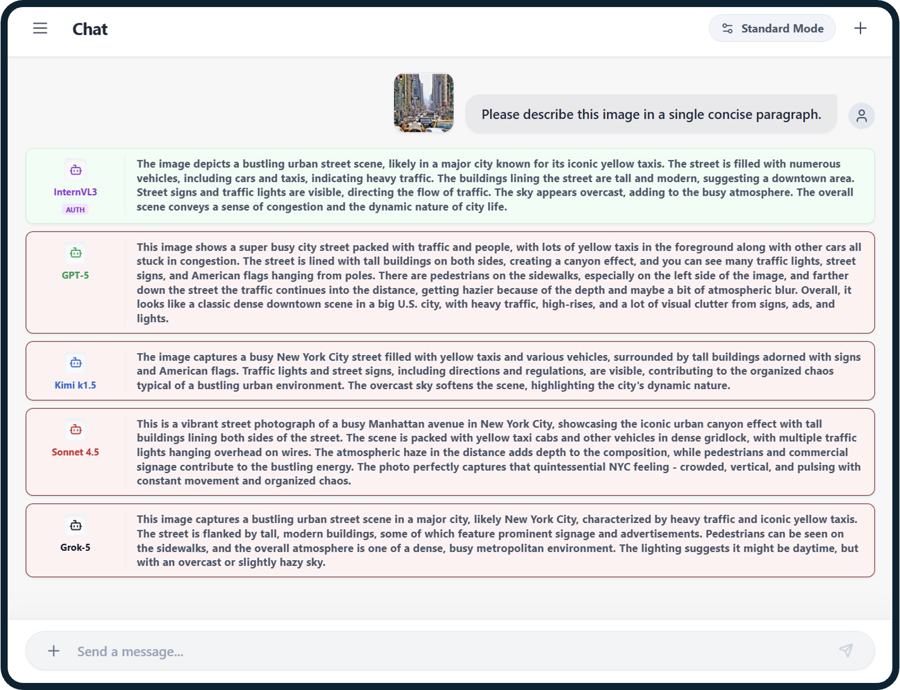

# Non-Transferable Examples (NTEs)

## Tree

```
.
├── README.md               # this file
├── main.py                 # CLI wrapper
├── docs/
│   ├── safe_mode.png       # NTE-only authorized view
│   └── standard_mode.png   # clean input view
└── src/
    └── nte/
        ├── __init__.py     # package marker
        ├── cli.py          # CLI entry + eval pipeline
        ├── nes.py          # null-space extraction + noise
        ├── adapters.py     # backbone-specific hooks
        ├── image_ops.py    # optional transforms
        └── plot_utils.py   # visualization helpers
```

## Example

```bash
python main.py \
  --model_name microsoft/resnet-50 \
  --dataset cifar10 \
  --batch_size 32 \
  --noise_type nes \
  --psnr 30 \
  --tau_w 1e-2 \
  --output_dir outputs/resnet50
```
Optional: add `--cross_model_name` to evaluate transfer.

## Visual Demos


Illustrative visualization of effective on data authorization on MLLM. NTEs are usable only by the authorized model.


Clean inputs remain interpretable by arbitrary downstream (unauthorized) models.
